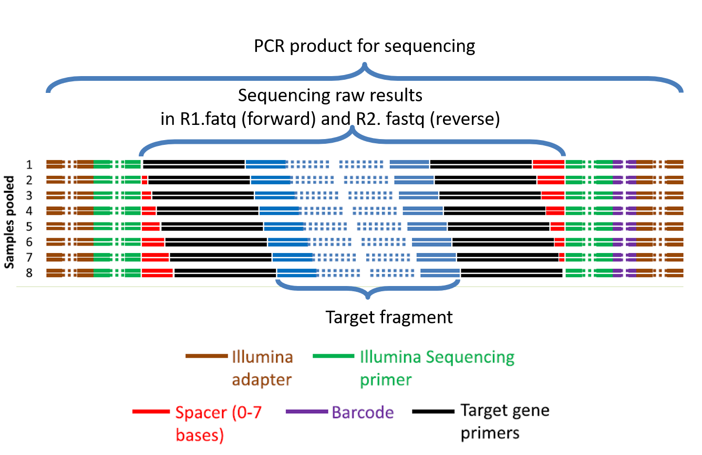

# QIIME2使用教程

Yufei Zeng, zengyf93@qq.com  
THU， 15/03/2020

-----

### 3. QIIME2
###### *About QIIME2*
QIIME2 is a next-generation microbiome bioinformatics platform that is extensible, free, open source, and community developed.

Official Tutorial: https://docs.qiime2.org/2019.10/tutorials/
中文版教程： https://blog.csdn.net/woodcorpse/article/details/77929607

###### 3.1 Import Data

   * data type: split files of fastq
   * data source: The University of Oklahoma
   * method: 18s rRNA high through-put amplicon sequencing
   * strategy: pair-end 250 bp without primer on V4 region (**(F565-R981, 416 bp)**)
   * forward primer: CCAGCASCYGCGGTAATTCC **(20 bp)**
   * reverse primer: ACTTTCGTTCTTGATYRA **(18 bp)**
   * The pre-required files: R1 data, R2 data, and mapping information

```
# activate QIIME2 environments
 conda activate qiime2-2020.2
qiime tools import \
--type 'SampleData[PairedEndSequencesWithQuality]' \
--input-path manifest.tsv \
--output-path demux.qza \
--input-format PairedEndFastqManifestPhred33V2
```

\# Preview the sequence quality
```
qiime demux summarize \
  --i-data demux.qza \
  --o-visualization demux.qzv
```
A easy way to preview it: https://view.qiime2.org/

###### 3.2 Denoise data by DADA2

The DADA2 algorithm makes use of a parametric error model (err) and every amplicon dataset has a different set of error rates. As in many machine-learning problems, the algorithm must begin with an initial guess, for which the maximum possible error rates in this data are used.
```
#evalutate the length of sequence in bad quality
qiime dada2 denoise-paired \
  --i-demultiplexed-seqs demux.qza \
  --p-trim-left-f 43 \
  --p-trim-left-r 42 \
  --p-trunc-len-f 245 \
  --p-trunc-len-r 200 \
  --o-table table.qza \
  --o-representative-sequences rep-seqs.qza \
  --o-denoising-stats denoising-stats.qza
```  
* `--p-trim-left-f` or `--p-trim-left-r`: the length for trimming beginning part of forward/reverse sequence  
* `--p-trunc-len-f` or `--p-trunc-len-r`:  the length for cut off end part of forward/reverse sequence  



*Think a question:*  
*The length of target fragment are 981 - 565 - (20+18) = 378 bp*  
*So what is the length of the merged sequence after denoising in this step?*

\# optional: visualize the DADA2 result
```
# OTU visualization
qiime feature-table summarize \
  --i-table table.qza \
  --o-visualization table.qzv

# representative sequences visualization
qiime feature-table tabulate-seqs \
  --i-data rep-seqs.qza \
  --o-visualization rep-seqs.qzv

# denoising information
qiime metadata tabulate \
  --m-input-file denoising-stats.qza \
  --o-visualization denoising-stats.qzv
```
\# optional: export the biom file
```
# export biom file
qiime tools export  \
  --input-path table.qza \
  --output-path result
# convert biom to tsv
biom convert -i result/feature-table.biom -o feature-table.tsv --to-tsv
# export representative sequences
qiime tools export  \
  --input-path rep-seqs.qza\
  --output-path result
```
###### 3.3 Taxanomy classifier
We will train the Naive Bayes classifier using silva_132 reference sequences (clustered at 99% similarity) and classify the representative sequences from the Moving Pictures dataset.

```
mkdir training_classifiers
cd training_classifiers
```
\# Two elements are required for training the classifier: the reference sequences and the corresponding taxonomic classifications.
```
qiime tools import \
  --type 'FeatureData[Sequence]' \
  --input-path silva_132_99_18S.fna \
  --output-path 99_silva_otus.qza

qiime tools import \
  --type 'FeatureData[Taxonomy]' \
  --input-format HeaderlessTSVTaxonomyFormat \
  --input-path silva_taxonomy_7_levels.txt \
  --output-path ref_silva_taxonomy.qza
```
 \# taxonomic classification accuracy of 16S rRNA gene sequences improves when a Naive Bayes classifier is trained on only the region of the target sequences that was sequenced (Werner et al., 2012).
```
qiime feature-classifier extract-reads \
  --i-sequences 99_silva_otus.qza \
  --p-f-primer CCAGCASCYGCGGTAATTCC \
  --p-r-primer ACTTTCGTTCTTGATYRA \
  --p-min-length 200 \
  --p-max-length 290 \
  --o-reads ref_silva_seqs.qza
```
```
qiime feature-classifier fit-classifier-naive-bayes \
  --i-reference-reads ref_silva_seqs.qza \
  --i-reference-taxonomy ref_silva_taxonomy.qza \
  --o-classifier silva_99_classifier.qza
```
\# classify the representative sequences from previous dataset
```
qiime feature-classifier classify-sklearn \
  --i-classifier  silva_99_classifier.qza \
  --i-reads ../rep-seqs.qza \
  --o-classification taxonomy.qza
qiime metadata tabulate \
  --m-input-file taxonomy.qza \
  --o-visualization taxonomy.qzv
```

### Summary
In this tutorial, we achieved following goals:
* Use Linux
* configure environment for processing dataset
* change the unstructural sequence data into structual dataframe
* annotate the genome of *E.coli* and taxanomy information of species
